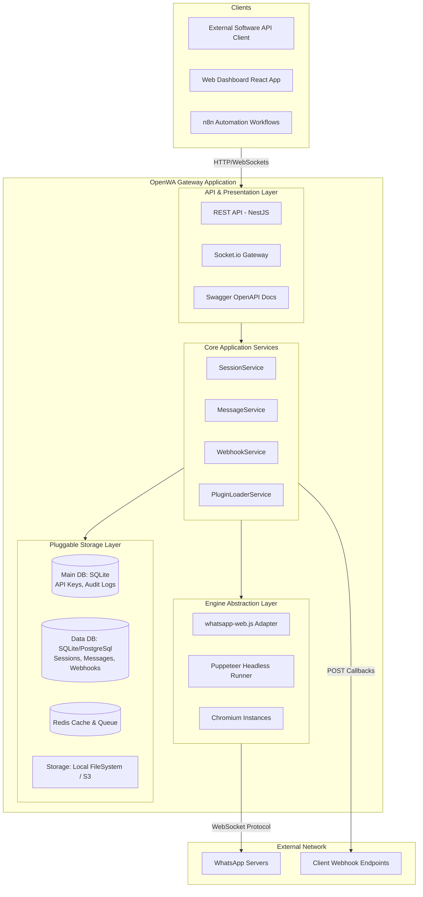
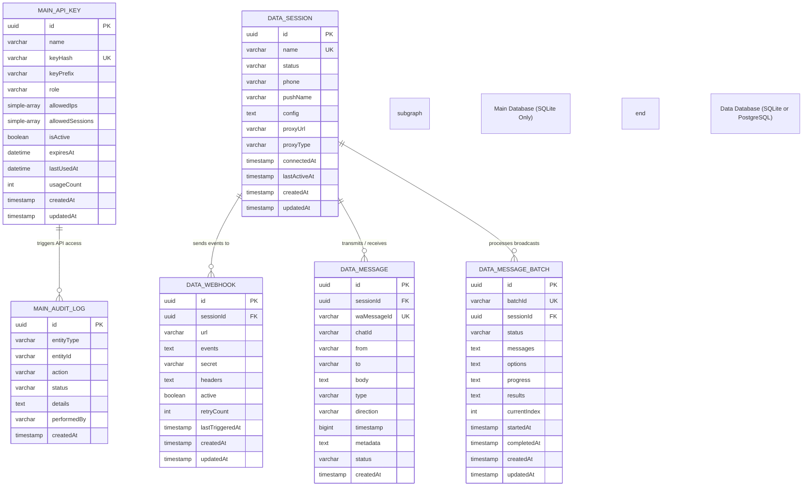
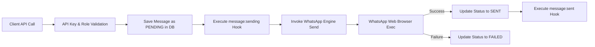
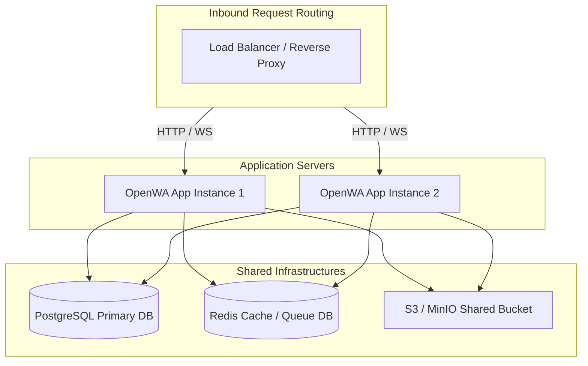

# OpenWA Project Architecture Document

## 1. Executive Summary

### 1.1 What the Application Does
**OpenWA** is a free, self-hosted, and 100% open-source WhatsApp API Gateway that provides an HTTP REST API for WhatsApp integration. It enables developers and businesses to connect their WhatsApp accounts and automate messaging, contacts, groups, and status updates through standardized web services.

### 1.2 Target Users
- **Developers:** Looking for a self-hosted, developer-friendly WhatsApp API wrapper with no feature gates or usage-based pricing.
- **Startups & Small-to-Medium Businesses (SMBs):** Automating customer outreach, CRM integrations, and alerts without recurring licensing costs.
- **Workflow Integrators:** Teams utilizing automation tools like n8n or Node-RED to build custom conversational workflows.
- **Agencies:** Managing multiple customer WhatsApp numbers under a single server installation.

### 1.3 Business Problem Solved
Paid gateways (e.g., WAHA Plus, Green API, Whapi.cloud) impose significant monthly per-session subscription costs and paywall critical production features such as PostgreSQL support, multi-session capabilities, and webhook management. OpenWA solves this by delivering an enterprise-ready, open-source alternative under the MIT license, keeping all operational data self-hosted and free from vendor lock-in.

### 1.4 Core Value Proposition
- **100% Free & Unlimited:** No paywalled features, session limits, or hidden fees.
- **Pluggable Architecture:** Easy configuration changes to swap databases (SQLite/PostgreSQL), storage (Local/S3), caching (In-Memory/Redis), and queues (Disabled/BullMQ).
- **Stealth Browser Wrapper:** Built on `whatsapp-web.js` using Puppeteer, simulating a real WhatsApp Web client with customized browser fingerprints to reduce device banning risks.
- **Built-In Dashboard:** Visual management interface for monitoring sessions, webhooks, API keys, logs, and testing messages out of the box.

### 1.5 Product Vision
To become the premier self-hosted, open-source API gateway for WhatsApp integrations, known for high stability, ease of deployment, robust security standards, and an active developer ecosystem.

---

## 2. Product Story

### 2.1 Why this Application Exists
Many businesses need to automate messaging (sending order confirmations, reminders, customer support alerts) over WhatsApp, which has over 2 billion active global users. However, Meta's official WhatsApp Business API has restrictive templates, approval bottlenecks, and variable messaging costs. Unofficial API gateways arose to bridge this gap, but the dominant options are closed-source and highly expensive. OpenWA was created to democratize self-hosted WhatsApp automation by providing a transparent, extensible, and free alternative.

### 2.2 Typical User (Operator) Journey
1. **Deployment:** The developer boots OpenWA via Docker Compose.
2. **Access:** They log into the Web Dashboard at `http://localhost:2886` using the automatically seeded default administrator API key.
3. **Session Creation:** The operator creates a session (e.g., `"support-line"`) and clicks **Start**.
4. **Authentication:** The dashboard displays a dynamically refreshed QR code. The operator scans it using their physical phone's WhatsApp application under "Linked Devices".
5. **Operational State:** The status switches to `CONNECTED`. The developer integrates the REST API with their existing CRM or customer support systems.

### 2.3 End-to-End Workflow Example: Customer Alerting
- A customer submits an order on a Shopify e-commerce store.
- The store backend fires a POST request to OpenWA: `/api/sessions/support-line/messages/send-text` with the payload `{"chatId": "123456789@c.us", "text": "Hi Bob, your order #1001 is confirmed!"}`.
- OpenWA validates the API Key, queries the active Puppeteer instance for the `"support-line"` session, and routes the message payload down to the headless browser.
- Puppeteer executes WhatsApp Web client-side code, dispatching the message over WebSocket directly to WhatsApp servers.
- The customer receives the message on their phone.

### 2.4 Main Business Processes
- **Multi-Session Connection:** Initializing, refreshing QR codes, and tracking connection states of up to dozens of parallel WhatsApp instances.
- **Media Asset Ingestion:** Hosting incoming media files (audio, image, document) in local storage or uploading them to an S3 bucket, then serving them back via public HTTP URLs.
- **Bulk Broadcasts:** Processing bulk marketing list message jobs asynchronously with custom inter-message delays to prevent WhatsApp spam filters from banning the sending numbers.
- **Real-Time Callbacks (Webhooks):** Dispatching instant events (messages received, group updates, session disconnects) to downstream consumer servers with automatic retries and HMAC-SHA256 signature verification.

---

## 3. System Architecture

OpenWA adopts a **layered, pluggable architecture** that separates API presentation, core application management, engine runtime abstraction, and pluggable storage adapters.

### 3.1 High-Level Architecture Diagram



### 3.2 Request Lifecycle

1. **Routing & Transport:** HTTP requests hit the NestJS web application (default port `2785`).
2. **Security & Guard Interception:** The `ApiKeyGuard` extracts the key from the `X-API-Key` or `Authorization` headers. It calculates the SHA-256 hash and validates the record against the `Main DB`. It also enforces IP CIDR restrictions and checks route-specific role levels (`admin`, `operator`, `viewer`).
3. **Throttling:** The `ThrottlerGuard` evaluates rate-limiting counters.
4. **Validation:** Request DTO payloads are parsed by `ValidationPipe` using `class-validator` rules.
5. **Business Logic Execution:** The controller delegates to a domain service (e.g. `MessageService`).
6. **Engine Invocation:** The service retrieves the active `IWhatsAppEngine` adapter mapping from memory and executes the underlying driver logic (such as sending a message via Puppeteer).
7. **Persistence:** The status is persisted to the `Data DB`.
8. **Event Dispatch:** A WebSocket notification is pushed to connected dashboard clients and a webhook request is queued.

---

## 4. Technology Stack Analysis

The system is split into two packages under a single git repository: the **NestJS Backend** and the **Vite React Frontend**.

### 4.1 Technology Component Matrix

| Layer | Selected Tech | Purpose | Rationale | Alternatives Considered |
|-------|---------------|---------|-----------|-------------------------|
| **Backend Framework** | **NestJS 11** | Application runtime, dependency injection, routing. | Highly structured, typescript-first, modular, easily handles enterprise scaling patterns. | Express.js (too unstructured), Fastify (less community plugins for TypeORM/BullMQ). |
| **Language** | **TypeScript 5.x** | Static typing, maintainability, type checks. | Reduces runtime syntax errors, strict mode ensures robust DTO parsing. | Vanilla JavaScript (lacks type safety). |
| **WhatsApp Wrapper** | **whatsapp-web.js** | Simulates a real browser client for WhatsApp Web. | Mature library, supports full messaging capability, lower ban rates compared to raw socket-based protocols because it runs a full Chromium container. | Baileys (socket-based, higher ban risk, frequent protocol changes), WAHA (closed-source plus features). |
| **Database ORM** | **TypeORM** | Object-Relational Mapper. | Strong support for multiple dialects (PostgreSQL and SQLite) within a single abstraction. | Prisma (complex dynamic multi-connection support), Mongoose (NoSQL only). |
| **Database (Boot)** | **SQLite** | Embedded database. | Guaranteed zero-dependency startup; API Keys and audit logs are ready instantly. | H2/NeDB (less standard, poor tooling). |
| **Database (Data)** | **PostgreSQL / SQLite** | Pluggable user data store. | SQLite for simplicity/low specs; PostgreSQL for concurrent write locking and production scaling. | MySQL/MariaDB (TypeORM supports, but PostgreSQL has superior JSON querying features). |
| **Cache & Queue** | **Redis & BullMQ** | Message queuing and caching. | BullMQ handles robust job retry backoff, prevents webhook packet loss during downstream outages. | RabbitMQ (harder to configure in NestJS), Kafka (overkill for simple webhooks). |
| **Frontend UI** | **React 19 & Vite** | Admin dashboard client. | Vite builds lightning-fast SPA bundles, React 19 handles complex states cleanly. | Next.js (not required for SPA dashboard), Vue.js (less standard in team stack). |
| **Styling** | **Tailwind CSS** | Styles styling system. | Speed of development, consistent grid systems. | Bootstrap (rigid), CSS Modules (slower). |

---

## 5. Main Dependencies Breakdown

| Dependency | Purpose | Where Used | Importance |
|------------|----------|------------|------------|
| `whatsapp-web.js` | Direct WhatsApp integration driver | `engine/adapters/whatsapp-web-js.adapter.ts` | **Critical** - Core messaging engine. |
| `typeorm` | DB abstractions and transaction management | `app.module.ts`, all entity repositories | **Critical** - All data storage routing. |
| `dockerode` | Direct Docker API socket manipulation | `modules/docker/docker.service.ts` | **High** - Built-in service container provisioning. |
| `@nestjs/bullmq` / `bullmq` | Webhook queues & asynchronous background jobs | `modules/queue/`, `modules/webhook/` | **High** - Background webhook delivery & bulk processing. |
| `helmet` | HTTP security headers | `main.ts` | **Medium** - Standard security compliance. |
| `socket.io` | WebSockets engine | `modules/events/events.gateway.ts` | **High** - Pushes real-time QR codes & updates. |
| `@tanstack/react-query` | Client-side API caching and state synchronization | `dashboard/src/App.tsx`, pages | **High** - Keeps dashboard screens fresh. |
| `i18next` | Localization & translation | `dashboard/src/i18n/` | **Medium** - Multi-language dashboard support. |

---

## 6. Folder Structure Analysis

OpenWA is structured as a monorepo setup but optimized for simple deployment, separating the server and client assets clearly.

```
openwa/
├── src/                                 # NestJS Application Source
│   ├── main.ts                          # Bootstrap script & safety overrides
│   ├── app.module.ts                    # Root module (initiates DBs, queues, modules)
│   ├── config/                          # Config mapping (configuration.ts)
│   ├── common/                          # Shared tools across multiple modules
│   │   ├── cache/                       # Redis wrapper
│   │   ├── storage/                     # Local/S3 storage providers
│   │   └── services/                    # Core Logger, Graceful Shutdown
│   ├── core/                            # Platform extension interfaces
│   │   ├── hooks/                       # Event interception pipelines
│   │   └── plugins/                     # Dynamic runtime code loader
│   ├── engine/                          # WhatsApp Engine adapters
│   │   └── adapters/                    # whatsapp-web-js.adapter.ts
│   └── modules/                         # Business Domain Modules
│       ├── auth/                        # API Key management, validation
│       ├── audit/                       # User/session operations tracking
│       ├── session/                     # WhatsApp Session lifecycle
│       ├── message/                     # Media & text message processors
│       ├── webhook/                     # Dynamic target delivery
│       ├── docker/                      # Container profile management
│       └── health/                      # Uptime probes
├── dashboard/                           # React Frontend Client (Vite)
│   ├── src/
│   │   ├── components/                  # Layout, Toast notifications
│   │   ├── pages/                       # Sessions, Logs, Message Tester
│   │   └── hooks/                       # useRole, websocket bindings
│   └── package.json
├── docs/                                # Project Specifications
└── package.json                         # Server entry & workspace runner
```

### Scalability Considerations
- **Isolated Engine Wrapper:** The `engine` directory contains only interfaces and adapter adapters. If `whatsapp-web.js` needs to be swapped out for a different engine (e.g., Baileys or an official Meta API adapter), it can be implemented as a new file in `engine/adapters` without affecting the REST controllers or services.
- **Separate Core and Domain:** Domain logic (`modules/`) interacts only with hooks and config. The code is modular, enabling developers to import only what is necessary or deploy clean microservices.

---

## 7. Database Design

OpenWA relies on a **dual-database design** to divide critical authentication/audit data from transactional user data, ensuring high boot reliability.

### 7.1 Entity Relationship Diagram



### 7.2 Core Table Constraints & Indexes
- **`api_keys` Table:** `keyHash` has a unique index. Querying checks exact hash matches.
- **`messages` Table:** Indexed on `[sessionId, createdAt]` and `[chatId]` to optimize history query performance. Unique constraint is enforced on `[sessionId, waMessageId]` to prevent double-inserting messages on connection retries.
- **`sessions` Table:** `name` has a unique constraint to avoid starting duplicate browser profiles.

---

## 8. API Architecture

### 8.1 API Conventions
- **Base Endpoint Prefix:** `/api`
- **Versioning:** Standardized path parameter versions are not yet fully implemented across all routes, but routes reside under standard namespace controllers (e.g. `/api/sessions`, `/api/infra`).
- **Response Format:** Success results are wrapped in a standard JSON wrapper:
  ```json
  {
    "success": true,
    "data": { ... }
  }
  ```
- **Error Format:** Failures yield consistent outputs:
  ```json
  {
    "success": false,
    "message": "Detailed error message",
    "error": "ERROR_CODE"
  }
  ```

### 8.2 Primary Endpoints Specifications

#### 1. POST `/api/sessions`
- **Purpose:** Create a new WhatsApp session entry.
- **Request Payload:**
  ```json
  { "name": "marketing-bot" }
  ```
- **Response:**
  ```json
  {
    "success": true,
    "data": { "id": "uuid", "name": "marketing-bot", "status": "created" }
  }
  ```

#### 2. POST `/api/sessions/:id/start`
- **Purpose:** Spawns a Chromium instance via Puppeteer and initializes the engine state machine.
- **Security:** Requires `operator` or `admin` role.

#### 3. GET `/api/sessions/:id/qr`
- **Purpose:** Retrieves the current active QR code (base64 string or raw text payload) to bind WhatsApp Web.
- **Response:**
  ```json
  {
    "success": true,
    "data": {
      "qrCode": "2@...",
      "status": "qr_ready"
    }
  }
  ```

#### 4. POST `/api/sessions/:sessionId/messages/send-text`
- **Purpose:** Sends a text message to a contact or group JID.
- **Request Payload:**
  ```json
  {
    "chatId": "1234567890@c.us",
    "text": "Your package has arrived!"
  }
  ```

#### 5. POST `/api/sessions/:sessionId/messages/send-bulk`
- **Purpose:** Dispatches bulk broadcasts using custom substitution variables and rate delay parameters.

---

## 9. Authentication & Authorization

OpenWA enforces a strict security guard layer using hashed API keys and hierarchical RBAC rules.

### 9.1 Authentication Guard Architecture
Requests must provide a key via the `X-API-Key` header or as a Bearer token in the `Authorization` header.
- **No Plaintext Keys stored:** Keys are hashed with SHA-256 before validation queries run, mitigating database leak risks.
- **Seeding:** On first launch, if zero keys exist, the `AuthService` writes a default admin key (prefixed with `owa_k1_` in production, or using the fallback `dev-admin-key` in dev) and persists it locally to `data/.api-key`.

### 9.2 Permissions Hierarchy
OpenWA supports three roles:

```
[ viewer ]  ◄── (Can only perform GET requests, view status)
     ▲
     │
[ operator ] ◄── (Can send messages, start/stop sessions)
     ▲
     │
[  admin   ] ◄── (Can manage API keys, toggle plugins, configure infra)
```

### 9.3 Route Protection
Decorators in NestJS mark endpoints as public (`@Public()`) or role-limited (`@Roles(ApiKeyRole.ADMIN)`).

```typescript
// Example from auth controller
@Controller('auth/api-keys')
@Roles(ApiKeyRole.ADMIN)
export class AuthController { ... }
```

---

## 10. Core Features Breakdown

### 10.1 Multi-Session Engine Manager
- **Description:** Allows starting and controlling parallel browser processes dynamically.
- **Flow:**
  - Invoking `/start` triggers the `EngineFactory` to construct a new wrapper instance.
  - The browser launches headlessly with specific flags (`--no-sandbox`, `--disable-setuid-sandbox`).
  - Listeners map events (`qr`, `ready`, `disconnected`) to the database state and push updates to clients via WebSockets.
- **Resource Lock:** Keeps browser profiles in isolated directories under `data/sessions/` to support clean instance recovery.

### 10.2 Outbound Messaging Pipeline


### 10.3 Inbound Event Hook & Webhook Dispatcher
- **Description:** Intercepts incoming messages, stores history, and alerts external systems.
- **Flow:**
  - Browser catches message event -> triggers engine adapter listener.
  - Normalizes target JID strings.
  - Executes the `message:received` hooks pipeline.
  - Persists the record to `messages` table.
  - Runs the Webhook dispatcher. If `queue.enabled=true`, pushes it to BullMQ to guarantee deliveries using exponential backoff retry.
  - Calculates HMAC signatures using the webhook endpoint secret: `X-OpenWA-Signature: sha256=<hex_hash>`.

---

## 11. State Management Architecture

### 11.1 Backend Memory Cache
The server keeps active browser process pointers inside a memory map (`Map<string, IWhatsAppEngine>`). Active reconnection retry timeouts are managed in a separate map to prevent memory leaks when deleting sessions.

### 11.2 Frontend State Management
The Vite React dashboard leverages modern, lightweight state synchronization libraries:
- **Zustand / Hooks:** Stores the current logged-in API Key, user details, and active roles.
- **TanStack Query (React Query):** Manages API query lifecycles, background updates, data caching, stale timeouts, and mutations.
- **Socket.io Client:** Connects to `/api` WebSockets namespace to listen for real-time events (`session-status`, `qr-code`, `message-received`) and triggers invalidations on cached TanStack Query models to keep dashboard views fresh.

---

## 12. Security Review

### 12.1 Authentication & Threat Vectors
- **Weakness:** Admin key details are dumped into `.api-key` file in plaintext. If the system directory is exposed, credentials can be leaked.
- **Mitigation:** Verify system configurations restrict folder read permissions to the service owner.

### 12.2 Input Sanitization & Validations
- **Implementation:** Custom class-validator rules check phone formats, webhook URLs, and string constraints to prevent SQL injection.
- **OWASP Vulnerability Protections:**
  - `helmet` is configured to set secure headers, preventing MIME sniffing, Clickjacking, and securing HSTS paths.
  - Parameterized queries inside TypeORM prevent SQL injection.

### 12.3 Recommended Security Upgrades
1. **API Key Encryption:** Hash API keys on entry using `bcrypt` instead of `sha256` to prevent lookup attacks.
2. **Encrypted Session Blobs:** If session tokens are exported, encrypt files using an environment-provided key (`AES-256-GCM`).

---

## 13. Performance Analysis

### 13.1 Resource Allocation
Headless browser processes consume significant CPU and RAM.
- **Memory Overhead:** Expect ~300MB - 500MB RAM consumption per running WhatsApp session. A standard VPS with 4GB RAM can safely support around 6-8 parallel instances before encountering swap bottlenecks.
- **Disk Space:** Media message persistence is a primary source of disk consumption. High-volume setups should route files to external S3 storage.

### 13.2 Database Scaling Optimizations
- **SQLite Limit:** SQLite locks the entire database file during writes. High-volume servers with parallel webhooks and broadcasts must use PostgreSQL.
- **TypeORM Pooling:** Set `DATABASE_POOL_SIZE` appropriately (default 10) to limit Postgres connections.
- **Partitions:** For PostgreSQL, partition the `messages` table by date ranges (e.g. monthly) to keep queries responsive as history rows exceed millions of records.

---

## 14. Deployment Architecture

OpenWA supports single-node deployments and scales out media storage and database workloads for production environments.

### 14.1 Production Multi-Instance Setup Diagram



### 14.2 Production Docker Profiles Configuration
The production stack uses `docker-compose.yml` configurations with profiles:
- `docker compose --profile full up -d` boots:
  - App Instance (Port 2785/2886)
  - PostgreSQL Database
  - Redis Cache & Queue
  - MinIO S3-compatible media storage
  - Traefik reverse proxy configuration

---

## 15. Development Standards

### 15.1 Coding Conventions
- **Language:** TypeScript 5.x with strict compile-time checks (`noImplicitAny`, `strictNullChecks`).
- **Style:** Formatted using Prettier rules and ESLint flat configurations.

### 15.2 Key Conventions
- **Named Exports:** Type declarations and interfaces must use named exports instead of default exports to prevent namespace pollution.
- **Controller Names:** File naming matches `<domain>.controller.ts`.
- **Dto Names:** File naming matches `<action>-<domain>.dto.ts`.

---

## 16. Future Scalability Plan

To scale OpenWA from small environments to enterprise workloads, the following steps are planned:

### 16.1 Distributed Worker Processes
Separate the NestJS REST API from the Puppeteer runners:
```
┌─────────────────┐       ┌───────────────┐       ┌─────────────────┐
│   REST API      │ ───►  │  Redis Queue  │ ───►  │ Engine Worker   │
│ (Lightweight)   │       │   (BullMQ)    │       │ (Runs Chrome)   │
└─────────────────┘       └───────────────┘       └─────────────────┘
```
This isolates browser crashes from the API, allowing the REST interface to remain fully responsive during high-load spikes.

### 16.2 WebRTC QR Streaming
Replace base64 QR polling with real-time WebRTC streams to deliver lower latency scan visualizers.

---

## 17. Risks & Technical Debt

### 17.1 Upstream Dependency Risks
- **Unofficial API Changes:** WhatsApp regularly updates its web protocol. If a breaking layout change occurs, `whatsapp-web.js` may fail until patch updates are released.
- **Memory Leak Risks:** Puppeteer browser processes can accumulate residual cache memory over long running periods.

### 17.2 Identified Technical Debt
- **Missing Unit Tests:** Coverage on engine adapters and webhook dispatchers is low.
- **Synchronous Backoff Fallback:** The fallback webhook dispatcher blocks the execution thread during retry operations when Redis is disabled.

---

## 18. Improvement Roadmap

### 18.1 Immediate Improvements (Priority: High)
- [ ] Add auto-restarting cron jobs to recycle browser instances that consume over 800MB RAM.
- [ ] Implement database-backed session token storage to support container restarts without losing authentication states.

### 18.2 Short-Term Improvements (Priority: Medium)
- [ ] Expand unit test coverage on the engine adapters.
- [ ] Integrate an optional WhatsApp Business Cloud API adapter for official integration support.

### 18.3 Long-Term Improvements (Priority: Low)
- [ ] Implement hot-swappable storage adapters to support zero-downtime database migration.
- [ ] Add native monitoring exports for Prometheus and Grafana.

---

## 19. Project Summary Card

| Property | Value |
|----------|-------|
| **Project Name** | OpenWA |
| **Project Type** | Self-Hosted WhatsApp HTTP API Gateway |
| **Target Users** | Developers, SMBs, Automation Engineers |
| **Frontend Stack** | React 19, Vite, Tailwind CSS, Lucide Icons, TanStack Query |
| **Backend Stack** | NestJS 11, TypeScript 5, Express |
| **Primary Databases** | SQLite (Main DB), SQLite / PostgreSQL (Data DB) |
| **Cache & Queue** | Redis, BullMQ (optional) |
| **Storage Backends** | Local Filesystem / AWS S3 / MinIO |
| **Auth System** | SHA-256 Hashed API Keys, IP CIDR Whitelist, HMAC Webhook Signatures |
| **Deployment** | Docker, Docker Compose (Multi-Profile) |
| **Scalability Rating** | **7 / 10** (Requires microservice separation for Puppeteer nodes to scale further) |
| **Security Rating** | **8 / 10** (Hashed keys, CORS restrictions, IP limits, HMAC signatures) |
| **Maintainability Rating** | **8 / 10** (Highly modular, clean dependency injection architecture) |

---

## 20. Final Verdict

### 20.1 Architecture Score: 8.5 / 10
OpenWA features a clean, professional architecture that implements solid software engineering patterns.

### 20.2 Key Strengths
- **Dual-Database Separation:** Excellent design choice to decouple authentication keys from transactional message tables.
- **Engine Layer Abstraction:** The clean decoupling of WhatsApp logic from REST routes simplifies future support for alternative engines (e.g. Baileys).
- **Comprehensive Infrastructure Controller:** Excellent endpoints for data migration and Docker container configuration.

### 20.3 Key Weaknesses
- **Puppeteer Resource Overhead:** Running headless browsers consumes significant RAM.
- **Synchronous Fallback Execution:** The database storage lacks hot-swap support without manual application restarts.

### 20.4 Production-Readiness
**Yes, with precautions.** OpenWA is production-ready for small and medium workloads (up to ~10 concurrent WhatsApp sessions). For large enterprise installations, you must enable PostgreSQL, Redis, S3 storage, and monitor RAM consumption closely.
